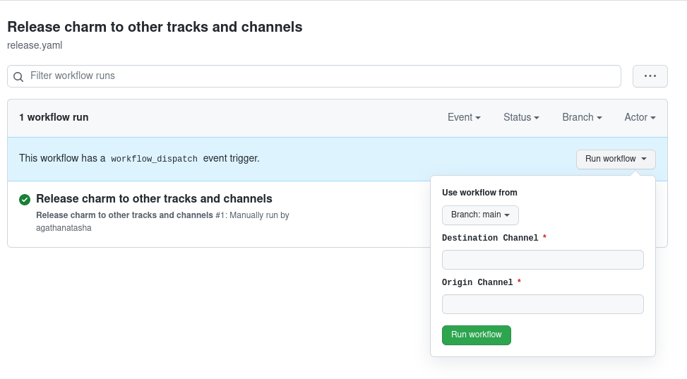

# canonical/charming-actions/release-charm

This action is used to release an already uploaded charm to a different channel in charmhub. It is designed to be manually triggered with the inputs. The revision of the charm must be uploaded using `upload-charm` action. It updates the existing revision release tag with the destination channel and timestamp.

## Usage

```yaml
name: Release charm to other tracks and channels

on:
  workflow_dispatch:
    inputs:
      destination-channel:
        description: 'Destination Channel'
        required: true
      origin-channel:
        description: 'Origin Channel'
        required: true
      # for multi charm repo
      charm-name:
        description: 'Charm Name'
        required: true
jobs:
  promote-charm:
    name: Promote charm
    runs-on: ubuntu-latest
    steps:
      - uses: actions/checkout@v2
      - name: Release charm to channel
        uses: canonical/charming-actions/release-charm
        with:
          credentials: ${{ secrets.CHARMCRAFT_CREDENTIALS }}
          github-token: ${{ secrets.GITHUB_TOKEN }}
          destination-channel: ${{ github.event.inputs.destination-channel }}
          origin-channel: ${{ github.event.inputs.origin-channel }}
          # for multi charm repo
          tag-prefix: ${{ github.event.inputs.charm-name }}
          charm-path: charms/${{ github.event.inputs.charm-name}}
```



In multi charm repo, you would also need to provide the charm path and tag prefix (same tag prefix used in `upload-charm` action) for the specific charm you are releasing. By convention, it should be the same the name of the charm. The example yaml provided above should work for must multi charm repo setup.
## API

### Inputs

| Key                  | Description                                                                                             | Required |
| -------------------- | ------------------------------------------------------------------------------------------------------- | -------- | 
| `credentials`        | Credentials [exported](https://juju.is/docs/sdk/remote-env-auth) using `charmcraft login --export`.     | ✔️       |
| `github-token`       | Github Token needed for automatic tagging when publishing                                               | ✔️       |
| `destination-channel`| Channel to which the charm will be released. It must be in the format of `track/risk`.                  | ✔️       |
| `origin-channel`     | Origin Channel from where the charm that needs to be promoted will be pulled.                           | ✔️       |
| `tag-prefix`         | Tag prefix, useful when bundling multiple charms in the same repo using a matrix.                       |          |     
| `charm-path`         | Path to the charm where `metadata.yaml` is located. Defaults to the current working directory.      |          |    
| `charmcraft-channel` | Snap channel to use when installing charmcraft. Defaults to `latest/edge`.                              |          |

### Outputs

None

### Limitations
- Doesn't work with charm that support multiple bases
- The origin channel must be in the format of `track/risk` for parsing the charmcraft status output.
- Only works for charm. It does not support releasing bundles.
- Does not support charm with channel branches as it would mess up the charmcraft status output.
